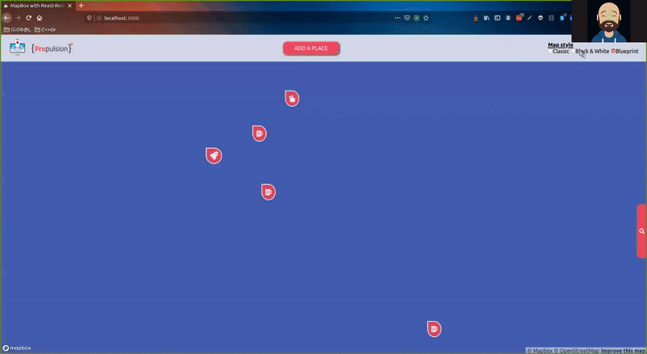

# Using MapBox with React-Redux 

With React-Redux & [MapBox](https://www.mapbox.com/), we could check places on a map regarding the Redux state, add new places and also search for new places created by the user. We can even change the style of the map regarding 3 links to Mapbox styles stored in our Navbar component.

> Tech: React, Redux, Styled Component

**How to work with this repo**
After the clone of the repo, please follow theses steps
- Create an account on [MapBox](https://account.mapbox.com/) and create a new token
- Create a `.env.local` file
- Copy-Paste the token on this new env file with the following structure `REACT_APP_MAPBOX_TOKEN="my.token.pasted.here"`